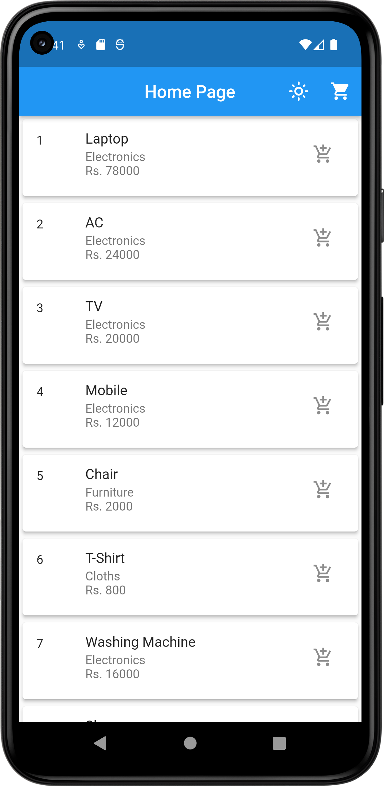
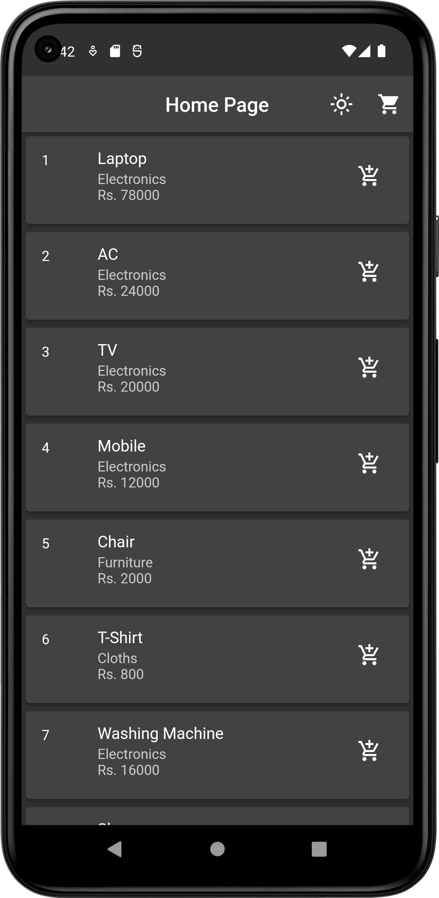
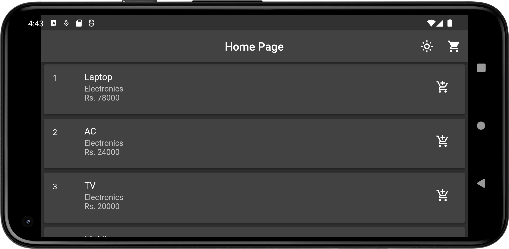
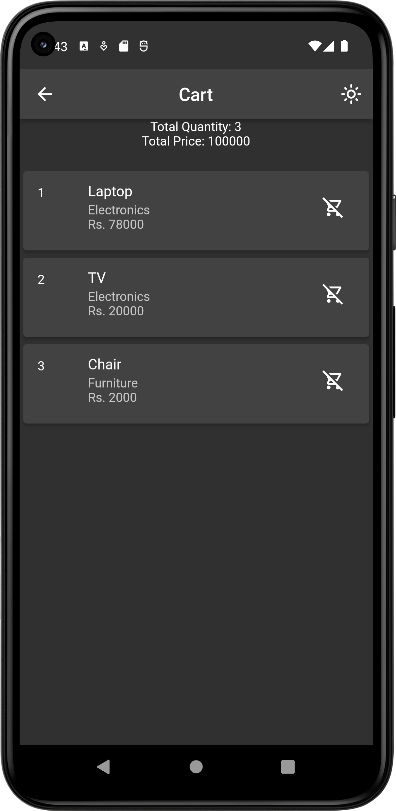

# **GetX App**
Simple GetX app made with Flutter in India.

---

## 🗒 About

This is a simple app for demonstrating Add to Cart functionality using GetX state management.

## ⚙️ Features

- Main features are as follows:
    - Listing all products with price and category
    - Light and Dark Theme
    - Add to Cart functionality
    - Remove from cart functionality
    - Total Price calculation

## 📲 Screenshots

  

## 📝 License

Copyright © [Milan Kathiriya](https://github.com/milankathiriya).  
This project is [MIT](LICENSE.md) licensed.

### Made with ❤️ in India.
  
---
### You can show some respect by starring 🌟 the repository!
---

